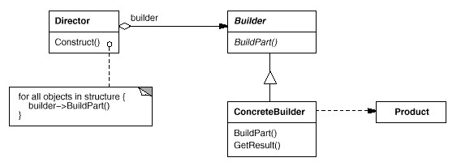
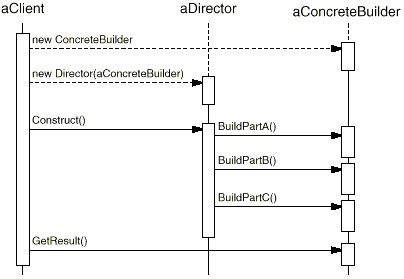

### 生成器模式(Builder)

#### 缘起 

假设创建游戏中的一个房屋 ``` House ``` 设施，该房屋的构建由几个部分组成，且各个部分要富于变化。

如果使用最直观的设计方法，每一个房屋部分的变化，都将导致房屋构建的重新修正……

#### 动机

在软件系统中，有时候面临着 ``` 一个复杂对象 ``` 的创建工作，其通常由各个部分的子对象用一定的算法构成；由于需求的变化，这个复杂对象的各个部分经常面临着剧烈的变化，但是将它们组合在一起的算法却相对稳定。

如何应对这种变化？如何提供一种 ``` 封装机制 ``` 来隔离出 ``` 复杂对象的各个部分 ``` 的变化，从而保持系统中的 ``` 稳定构建算法 ``` 不随着需求改变而改变？

#### 意图

将一个复杂对象的构建与其表示相分离，使得同样的构建过程可以创建不同的表示

#### 结构



#### 协作




#### 几个要点

1、``` Builder ``` 模式主要用于 ``` 分步骤构建一个复杂的对象 ``` 。在这其中  ``` 分步骤 ``` 是一个稳定的算法，而复杂对象的各个部分则经常变化

2、变化点在哪里，封装哪里。 ``` Builder ``` 模式主要在于应对 ``` 复杂对象各个部分 ``` 的频繁需求变动。其
缺点在于难以应对 ``` 分步骤构建算法 ``` 的需求变动

3、``` Abstract Factory ``` 模式解决 ``` 系列对象 ``` 的需求变化， ``` Builder ``` 模式解决 ``` 对象部分 ``` 的需求变化

4、``` Builder ``` 模式通常和 ``` Composite ``` 模式组合使用
