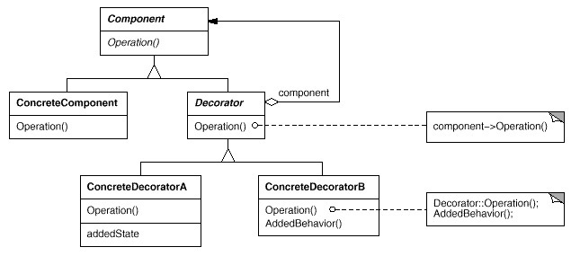

## Decorator 装饰

### 子类复子类，子类何其多

假如我们需要为游戏中开发一种坦克，除了各种不同型号的坦克外，我们还希望在不同场合中为其增加以下一种或多种功能：比如红外线夜视功能，比如水陆两栖功能，比如卫星定位功能等等。

```
// 抽象坦克
public abstract class Tank {
    public abstract Shot();
    public abstract Run();
}

//各种型号
public class T50: Tank {……}
public class T75: Tank {……}
public class T90: Tank {……}

//各种不同功能的组合
public class T50A: T50, IA {…}
public class T50B: T50, IB {…}
public class T50C: T50, IC {…}
public class T50AB: T50, IA, IB {…}
public class T50BC: T50, IB, IC {…}
public class T50ABC: T50, IA, IB, IC{...}
```

### 描述

装饰者提供比继承更有弹性的替代方案。 装饰者用用于包装同接口的对象，不仅允许你向方法添加行为，而且还可以将方法设置成原始对象调用（例如装饰者的构造函数）

### 动机

上述描述的问题根源在于我们 ```过度地使用了继承来扩展对象的功能 ```，由于继承为类型引入的静态特质，使得这种扩展方式缺乏灵活性；并且随着子类的增多（扩展功能的增多），各种子类的组合（扩展功能的组合）会导致更多子类的膨胀（多继承）。

如何使 ```对象功能的扩展 ```能够根据需要来动态地实现？同时避免 ```扩展功能的增多 ```带来的子类膨胀问题？从而使得任何 ```功能扩展变化 ```所导致的影响将为最低？

### 意图（Intent）

动态地给一个对象增加一些额外的职责。就增加功能而言，Decorator模式比生成子类更为灵活。

### 结构



### 几个要点

* 通过采用组合、而非继承的手法， Decorator模式实现了在运行时动态地扩展对象功能的能力，而且可以根据需要扩展多个功能。避免了单独使用继承带来的 ```灵活性差 ```和 ```多子类衍生问题 ```。

* Component类在Decorator模式中充当抽象接口的角色，不应该去实现具体的行为。而且Decorator类对于Component类应该透明——换言之Component类无需知道Decorator类，Decorator类是从外部来扩展Component类的功能。

* Decorator类在接口上表现为is-a Component的继承关系，即Decorator类继承了Component类所具有的接口。但在实现上又表现为has-a Component的组合关系，即Decorator类又使用了另外一个Component类。我们可以使用一个或者多个Decorator对象来 ```装饰 ```一个Component对象，且装饰后的对象仍然是一个Component对象。

* Decorator模式并非解决 ```多子类衍生的多继承 ```问题，Decorator模式应用的要点在于解决 ```主体类在多个方向上的扩展功能 ```——是为 ```装饰 ```的含义。