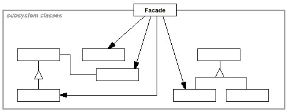

### 系统的复杂度

假设我们需要开发一个坦克模拟系统用于模拟坦克车在各种作战环境中的行为，其中坦克系统由引擎、控制器、车轮、车身等各子系统构成。

public class Wheel {
    public void WAction1() {
        //todo
    }
    public void WAction2() {
        //todo
    }
}

public class Engine {
    public void EAction1() {
        //todo
    }
    public void EAction2() {
        //todo
    }
}

public class Bodywork {
    public void BAction1() {
        //todo
    }
    public void BAction2() {
        //todo
    }
}

public class Controller {
    public void CAction1() {
        //todo
    }
    public void CAction2() {
        //todo
    }
}

### 如何使用这样的系统

方案 A                         方案 B 

### 动机（Motivation）

上述A方案的问题在于组件的客户和组件中各种复杂的子系统有了过多的耦合，随着外部客户程序和各子系统的演化，这种过多的耦合面临很多变化的挑战。

如何简化外部客户程序和系统间的交互接口？如何将外部客户程序的演化和内部子系统的变化之间的依赖相互解耦？

### 意图（Intent）

为子系统中的一组接口提供一个一致的界面，Façade模式定义了一个高层接口，这个接口使得这一子系统更加容易使用。

### 实现

### 几个要点

* 从客户程序的角度来看， Facade模式不仅简化了整个组件系统的接口，同时对于组件内部与外部客户程序来说，从某种程度上也达到了一种“解耦”的效果——内部子系统的任何变化不会影响到Façade接口的变化。

* Façade设计模式更注重从架构的层次去看整个系统，而不是单个类的层次。Façade很多时候更是一种架构设计模式。

* 注意区分Façade模式、Adapter模式、Bridge模式与Decorator模式。Façade模式注重简化接口，Adapter模式注重转换接口，Bridge模式注重分离接口（抽象）与其实现，Decorator模式注重稳定接口的前提下为对象扩展功能。

### 总结

那么何时使用外观模式呢？一般来说分三个阶段。

首先，在设计初期，应该要有意识地将不同的两个层分离，比如经典的三层结构，在数据访问层和业务逻辑层、业务逻辑层和表示层之间建立外观Facade。

其次，在开发阶段，子系统往往因为不断的重构演化而变得越来越复杂，增加外观Facade可以提供一个简单的接口，减少他们之间的依赖。

第三，在维护一个遗留的大型系统时，可能这个系统已经很难维护了，这时候使用外观Facade也是非常合适的，为系系统开发一个外观Facade类，为设计粗糙和高度复杂的遗留代码提供比较清晰的接口，让新系统和Facade对象交互，Facade与遗留代码交互所有的复杂工作。