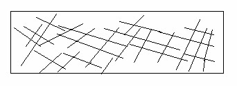
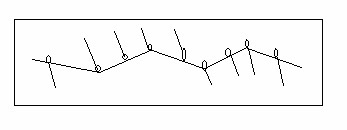
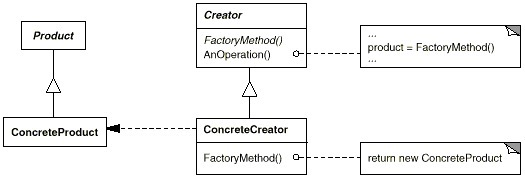

### 工厂方法（Factory Method）

#### 从耦合关系谈起

耦合关系直接决定着软件面对变化时的行为

模块与模块之间的紧耦合使得软件面对变化时，相关的模块都要随之更改。



模块与模块之间的松耦合使得软件面对变化时，一些模块更容易被替换或者更改，但其他模块保持不变。



#### 动机

在软件系统中，经常面临着 ``` 某个对象 ``` 的创建工作；由于需求的变化，这个对象经常面临着剧烈的变化，但是它却拥有比较稳定的接口。

应对这种变化，如何提供一种 ``` 封装机制 ``` 来隔离出 ``` 这个易变对象 ``` 的变化，从而保持系统中 ``` 其他依赖该对象的对象 ``` 不随着需求改变而改变？
 
#### 意图

定义一个用于创建对象的接口，让子类决定实例化哪一个类。 ``` Factory Method ``` 使得一个类的实例化延迟到子类。

#### 结构



#### 几个要点

*  ``` Factory Method ``` 模式主要用于隔离类对象的使用者和具体类型之间的耦合关系。面对一个经常变化的具体类型，紧耦合关系会导致软件的脆弱
* ``` Factory Method ``` 模式通过面向对象的手法，将所要创建的具体对象工作延迟到子类，从而实现一种扩展（而非更改）的策略，较好地解决了这种紧耦合关系
*  ``` Factory Method ``` 模式解决 ``` 单个对象 ``` 的需求变化， ``` Abstract Factory ``` 模式解决 ``` 系列对象 ``` 的需求变化， ``` Builder ``` 模式解决 ``` 对象部分 ``` 的需求变化

#### 使用场景
* 对象的构建十分复杂
* 需要依赖具体环境创建不同实例
* 处理大量具有相同属性的小对象